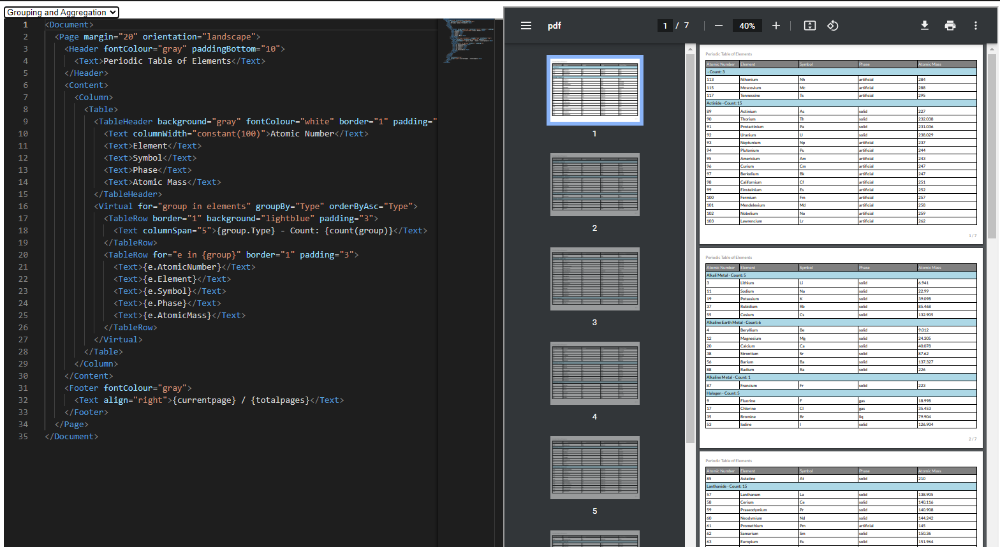

# Lattice

A library to aid in generating PDFs from a serializable data format, utilising the fantastic [QuestPDF](https://github.com/QuestPDF/QuestPDF) library. 

Supporting most of the QuestPDF layout and formatting options, Lattice can create (almost) any PDF file using nested layout types such as tables, grids, rows, columns, etc. 

To supplement the library, an XML based web frontend is available with some basic intellisense support and examples.

## Key Features

- Simple serializable format for saving and loading templates.
- Very fast and highly customisable page layouts thanks to QuestPDF.
- Data extraction, with looping, grouping, simple aggregation and ordering.

## Usage

- Node.js is required for building the frontend.
- Clone the repo.
- Open the project in VS or Rider.
- Install NuGet dependencies.
- Run Lattice.Web and open http://localhost:3000 to access the Vite frontend.

Alternatively run in Docker.
- Open the root folder with the Dockerfile.
- `docker build -t lattice .`
- `docker run -dp 8888:8888 lattice`
- Visit http://localhost:8888 to access the UI.

It's possible to create PDFs that loop indefinitely and will consume CPU resources so be careful.

